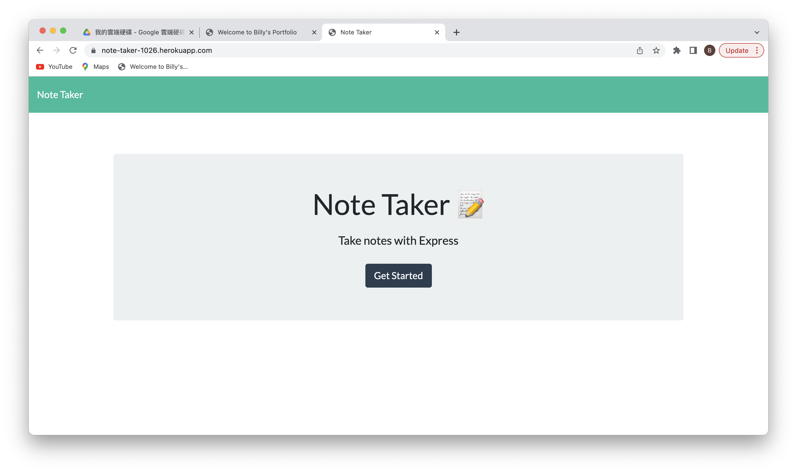

# Note Taker

  [](https://www.javascript.com)

  ## Description 
  > This is a simple web application deployed to Heroku which allow users to add/remove/view the to-do list. 
  

  ## Table of Contents
  
  * [Installation](#installation)
  * [Technologies](#technologies)
  * [Usage](#usage)
  * [Contributing](#contributing)
  * [Test](#test)
  * [Live URL](#live-url)
  * [Screenshots](#screenshots)
  * [Questions](#questions)
  * [Github](#github)
  * [License](#license)
  

  ## Installation
  > No installation is required to run the application from Live URL.  
  
  > To run the application from terminal, Express.js is required to install.  To install necesary dependencies, include the dependencies in the package.json file and run the following command from the terminal:
  
  ```
  npm i
  ```
  
  ## Technologies 
  > The following technologies is used for this application. 

  ```
  1. HTML
  2. JavaScript 
  3. Bootstrap CSS Framework 
  4. Express.js
  ```

  ## Usage
  > To start the application, click on the URL in the Live URL section. 
  

  ## Contributing
  > To contribue to this application, please contact Bily Cheng by the email address shown below.
  

  ## Test 
  The below test cases are run manually and the test result is as below:

|   | Feature Description                                                                                                                                                                     | Test Result |
|:-:|-----------------------------------------------------------------------------------------------------------------------------------------------------------------------------------------|:-----------:|
| 1 | Click on the Live URL.  The homepage of the note taker is shown on the screen.                                                                                                          |     Pass    |
| 2 | Click on the "Get Started" button on the homepage.  The notes page is shown on the screen.  Save Notes are shown on the left pane.  New Note Title and Text are shown on the right pane |     Pass    |
| 3 | When inputting both New Note Title and Text,  Save Button is shown on the right upper corner.                                                                                           |     Pass    |
| 4 | When clicking on "Save" button,  The new note is saved and shown on the left pane.                                                                                                      |     Pass    |
| 5 | When clicking on the Note just saved on left pane,  Corresponding Note Title and Text are shown on the right pane                                                                       |     Pass    |
| 6 | When clicking on the "Delete" button next to the Note Title in the left pane,  The Note is removed from the screen.                                                                     |     Pass    |
| 7 | When clicking on the "+" button at the right upper corner,  New Note Title and New Text are shown for edit.                                                                             |     Pass    |
| 8 | When clicking the logo "Note Taker" at the left upper corner,  the home page of the application is shown on the screen.                                                                 |     Pass    |
| 9 | When closing the existing session and open a new browser to load the application,  The application is open and all the previous saved notes are retained and shown not the screen.      |     Pass    |

  ## Live URL
  
  https://note-taker-1026.herokuapp.com/
  

  ## Screenshots
  

  

  

  

  

  

  ## Questions
  > Should you have any questions, please send email to chengpitchi@yahoo.com. 
  

  ## Github
  > https://github.com/chengpitchi/note-taker
  
  
  ## License 
  > This applicaiton is covered under JavaScript.
